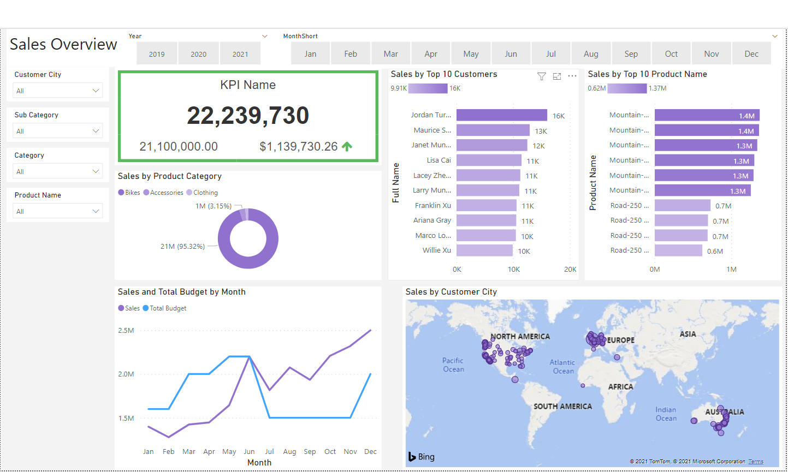

## Data Analytics Portfolio by Ibrahim Wasti

This portfolio is a compilation of notebooks which I used for exploratory data analysis, dashboard creation, database management, and building models. Each section will have different projects.

----

## Classification Projects

### Amazon Book Reviews - Sentiment Classification
*[Notebook](https://nbviewer.jupyter.org/github/Ibrahim-Wasti/Amazon-Reviews-Classifier/blob/main/amazon-ml-proj.ipynb) | [Repository](https://github.com/Ibrahim-Wasti/Amazon-Reviews-Classifier)*

Created a sentiment classifier for book reviews on Amazon using the following tools and methods:
  - Pandas, numpy, and json to load, manipulate, and prepare the data for training
  - Bag of words vectorization was used for training using the TFIFD vectorizer provided in the Sci-kit learn library
  - Used SVC, Decision Tree, Gaussian Naive Bayes, and Logistic Regression as base models before tuning.
  - GridSearchCV for hyperparameter tuning for the SVM model as it performed the best at base
  - Pickle for saving and exporting the model
#

<!--- 

 --->

### HR Analytics: Data Scientists who change their jobs - Classification
*[Notebook](https://nbviewer.jupyter.org/github/Ibrahim-Wasti/DataScience-HR-Analytics/blob/main/Data%20Science%20HR%20Analytics%20EDA.ipynb) | [Repository](https://github.com/Ibrahim-Wasti/DataScience-HR-Analytics)*

Analysis of Data Scientists who changed their jobs. Created a classifier with an overall accuracy of 80% and high recall and precision for target group.
  - Loaded, manipulated, and prepared the data for exploration using Pandas.
  - Exploratory data analysis conducted using Pandas and visualizations done using Seaborn and Matplotlib.
  - Prepared the data for classification using Scikit Learn.
  - Created a Calssifier with XGBoost, and performed hyperparameter tuning using GridSearch and cross validation.
 
The general datset and more information can be found on [Kaggle](https://www.kaggle.com/arashnic/hr-analytics-job-change-of-data-scientists). 

<!--- 

 --->
<!--- 

 --->

### Rock CLimbing Shoes Scraper & Company Classification
*[Repository](https://github.com/Ibrahim-Wasti/RockClimbingShoes)*

Scraper to collect and store information on Rocking CLimbing shoes from various manufacturers. Cleaning, transforming, and mainpulating that data to create a model that can classify the shoe manufacturer from a few features.
- Built a web scraper to collect data on climbing shoes from REI.com, such as price, shoe, rubber, etc.
- Collected this data into a csv and ingested into the analysis notebook
- Used pandas to view the data and determine its quality
- Cleaned any data that needed remedying and transformed the data as needed
- Used seaborn to visualize the data from price correlation to most popular shoes by year
- Used XGB to create a model that can predict the maker of a shoe from the data collected
- Images of the feature selection and model are available in the repository under source.gv.pdf and image.pdf

----

## Regression Projects

### NBA Hollinger Player Efficiency Rating - Prediction
*[Notebook](https://nbviewer.jupyter.org/github/Ibrahim-Wasti/NBA-Hollinger-Player-Efficiency-Rating/blob/main/Exploratory%20Analysis%20and%20Modeling.ipynb) | [Repository](https://github.com/Ibrahim-Wasti/NBA-Hollinger-Player-Efficiency-Rating)*

Used BeautifulSoup4, requests, and regex libraries to scrape the ESPN Hollinger website to create a dataset of players with 12 features, Player Efficiency Rating (PER) being the target variable. The scraper can be viewed [here](https://nbviewer.jupyter.org/github/Ibrahim-Wasti/NBA-Hollinger-Player-Efficiency-Rating/blob/main/NBA%20Player%20Stats%20Scraper.ipynb). Saved the data as a list of dictionaries to a json file for easy loading in and conversion to a dataframe when conducting data exploration, analysis, and modelling. Used Pandas, Seaborn, MPL, SK-Learn, and XGBoost for the above stated exploration, analysis, and modelling.

- Feature selection for the SK-Learn model done using Pearson Correlation as this was Linear Regression probelm.
- Used seaborn and IQR to get rid of outliers in the dataset, this increased the accuracy of the final model.
- Modelled using SK-Learn for a base accuracy score (measured by RMSE) to see if XGB would give better results.
- XGB Regressor performed with a higher accuracy (lower RMSE) than the SK-Learn model.
#

<!--- 

 --->
<!--- 

 --->

### E-commerce Regression
*[Notebook](https://nbviewer.jupyter.org/github/Ibrahim-Wasti/E-commerce-Regressor/blob/main/E-commerce%20Regression.ipynb) | [Repository](https://github.com/Ibrahim-Wasti/E-commerce-Regressor)*

Predicting the yearly amoutn spent by customers. Obtained a best model that had an RMSE of 8.522 (standard deviation of target column is ~79) and an R2 score of ~98%. Small dataset of customer information used to predict the Yearly amount spent by customers.
- Pandas and seaborn used for data manipulation and visualization
- Sci-kit Learn and XGBoost used for model training and predicting
  - LinearRegressor, DecisionTree Regressor, and ElasticNet used from SK-Learn
  - XGBRegressor used from XGBoost

<!--- 

 --->

----

## Finance Projects

### Portfolio Optimization
*[Notebook](https://nbviewer.jupyter.org/github/Ibrahim-Wasti/Portfolio-Optimization/blob/main/Portfolio%20Optimization.ipynb) | [Repository](https://github.com/Ibrahim-Wasti/Portfolio-Optimization)*

Program that uses the Sharpe Ratio to retrun recommendations for an optimized protfolio strategy.

1) Takes as input a list of tickers, the desired satrt date, a list of the weight of each ticker relative to its position in the tickers list, and the total amount invested in USD ($).
2) Optional arguments:
    - End date is predfined to the current day, however can be specified
    - Graph: predefined as False. If True then will return a time series graph for each ticker in the tickers list
    - Verbose: predefined as True and will return Expected Annual returns, Vaolatility, & Volume in addition to the Sharpe Ratio an drecommendations. If False, will only return Sharpe ratio and recommendations.

*Pulls data from the Alpha Vantage (av-daily-adjusted) API*
#

### S&P 500 Equal Weight Screener

Program that will provide a formatted Excel workbook with 4 columns, Ticker, Price per Share, Market Cap, and Number of shares to buy. This is an equal weight screener, meaning all tickers have the same wieght.

Inputs:
  1) Batch_size: the allowed batch_size for the API, or any number less than the max allowed by the API. (tThis program uses ALpha Vantage which has batch call max of 100)
  2) Portfolio_size: The amount in USD that will be invested 
  3) Export: export is predefined as False, however if defined as True then an Excel workbook will be created
    - The only input required is the name of the file to be written
  *Note: The workbook will be saved in the same working directory/folder as the program*
#

<!--- ### Quantitative Value Screener

### Quantitative Momentum Screener 

### 3 Statement Model Builder

Script to creat and save a  3-statemnet model (Income statment, balance sheet, & Cash flow statemnt) pulling information from the Alpha Vantage API, and saving as an Excel workbook.

  1) Takes as Input a ticker symbol (eg. aapl), and number of periods (eg. 5).
  2) Creates dataframes using pandas with all relevant information for each statement (aka each sheet in the Excel Workbook)
  3) Writes to an Excel workbook with a predefined formatting and saves this xlsx file in the same folder where the script is being run.

-->
## Exploratory Analytics Projects

### Sales Analysis 
*[Notebook](https://nbviewer.jupyter.org/github/Ibrahim-Wasti/Sales-Data-Analysis/blob/main/Sales_Analysis.ipynb) | [Repository](https://github.com/Ibrahim-Wasti/Sales-Data-Analysis)*

Project done for class, an analysis of sales for 2019 of an e-commerce company. Merged 12 files of sales data into one dataframe using the OS and Pandas libraries. Visualizations were created using MatPlotLib. Answered different questions to gain insights into the data and come to conclusions that would effect the company's strategy in marketing and staffing.
#

<!--- 

 --->
<!--- 

 --->

### Netflix: Movies & TV Shows 
*[Notebook](https://nbviewer.jupyter.org/github/Ibrahim-Wasti/Netflix-Movies-and-TV-Shows-EDA/blob/main/Netflix%20TV%20Shows%20%26%20Movies%20EDA.ipynb) | [Repository](https://github.com/Ibrahim-Wasti/Netflix-Movies-and-TV-Shows-EDA)*

This was a dataset which provided information on different aspects of the content on Netflix, from the director and cast to the availability by country. Tasks were to show top acotrs/directors, top countries by number of productions, amount of content for each age group, etc. All these questions were answered uding a combination of Pandas, Seaborn, and Matplotlib. The general datset and more information can be found on [Kaggle](https://www.kaggle.com/shivamb/netflix-shows).
#

<!--- 

 --->
<!--- 

 --->

### Sales & Marketing Dashboard using Power BI
*[Repository](https://github.com/Ibrahim-Wasti/Dashboard-with-PowerBI)*

Created a Power BI dashboard in accordance with businees request from client:
- Visualizing KPIs
- Sales analysis of total revenue, revenue by product, and revenue by employee
- Customer analysis by region and sales
Extracted the data from Microsoft SQL Serever (Queries can be fouind in the repo). Created a data model in Power BI and prepared the data for visualization and analysis. Visualized the different parameters and metrics using a variety of charts, graphs, and other tools available through Power BI.

<!--- 

 --->
<!--- 

 --->

----

## Other Projects

### Chess Engine 
*[Repository](https://github.com/Ibrahim-Wasti/Chess)*

Chess engine created in Python using Pygame for the GUI.

- Pygame usage:
  - Created a menu where a player can choose an option to play against AI or against another person
  - Created a side panel which displays all the moves made in correct chess notation
  - Clicking on a piece during your turn will highlight that piece as well as highlight all valid squares where it may move
  - Once the piece is moed it will be animated moving from the strat sqaure to the end sqaure
  
- Created the game board and implemented the rules of chess using a 2D array and indexing to define piece locations, possible moves, and all valid (allowed) moves
- Implemented NegaMax algorithm with alpha-beta pruning to increase efficiency and turn depth allowing for stronger moevs to be played
- The scoring algorithm consists of piece values, positional value, the amount of threats, pins, and checks each move creates as well bonuses for special moves such as castling and pawn promotion
#

### Backend Development - Web App
*[Repository](https://github.com/Ibrahim-Wasti/fastapi)*

Basic backend development for any Web App using FastAPI, PostgreSQL, SQLAlchemy, and Alembic to create and interact with the database instance.

- FastAPI usage: 
   - Implementation of CRUD operations, such as, creating a user, updating a post, deleting a post, and fetching/reading a post.
   - Authentication done using Bearet tokens with JWT encryption
- SQLalchemy & PostgreSQL:
  - SQLalchemy used for building tables and communicating with the PostgreSQL instance
  - PostgresSQL used for storing all the information in tables such as Users, Posts, etc.
- Alembic:
  - Updating tables, schemas, etc. without having to go through PostgreSQL

---

_Further detail for all projects can be found by clicking (CTRL + click for new tab) their respective **Repository** links found beneath the title of every project. To view the notebooks where the code was written please click on the **Notebook** link which will show you the notebook using JupyterLab's online interface (nbviewer)._ 

## Encyption Algorithms 

### RSA
*[Script](https://github.com/Ibrahim-Wasti/Encryptions/blob/main/rsa.py)*

Created an RSA encryption/decryption script for practice with encryption/decryption
- Max size for keys is 2^32 which is much smaller than industry standards, but this was for practice so to make sure things were fast the max size was capped
- Implemented different mathematical checks, such as RabinMiller and a standard prime numbers check 

